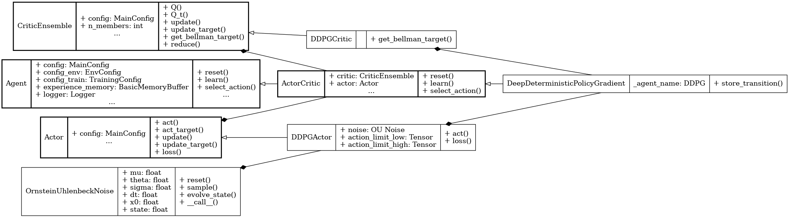

Deep Deterministic Policy Gradient (DDPG)
=========================================

.. raw:: html

   off-policy
   deterministic

**Paper**: `Continuous Control with Deep Reinforcement Learning <https://arxiv.org/abs/1509.02971>`_

Pseudocode
----------

.. pdf-include:: ../../_static/pseudocodes/ddpg.pdf
    :width: 100%

Configuration
----------------

.. literalinclude:: ../../../objectrl/config/model_configs/ddpg.py
    :language: python
    :start-after: [start-config]
    :end-before: [end-config]
    :caption: Specific configuration for the DDPG algorithm (in config/model_configs/).

UML Diagram
----------------

    UML diagram for the DDPG algorithm.

.. raw:: html

   
We use the UML diagram to illustrate the relationships between the classes in our DDPG implementation.

   
The diagram shows how the <code>DDPGActor</code> and <code>DDPGCritic</code> classes inherit from the base classes <code>Actor</code> and <code>CriticEnsemble</code>, respectively. <code>DeepDeterministicPolicyGradient</code> class also inherits from <code>ActorCritic</code> class which inherits from <code>Agent</code>.

   
We illustrate each class's crucial attributes and methods for DDPG. Specifically: 

   
<code>get_bellman_target()</code> method in <code>DDPGCritic</code> class is implemented to compute the Bellman target for the critic in DDPG style.

   
 <code>act()</code> and <code>loss()</code> methods in <code>DDPGActor</code> class are implemented to act in DDPG style and update the actor's policy.

Exploration Noise
-----------------

.. raw:: html

   
We use the <code>OrnsteinUhlenbeckNoise</code> class to inject noise into the actor's actions to encourage exploration. This noise process is commonly used in DDPG for continuous action spaces due to its temporal correlation.

.. autoclass:: objectrl.models.ddpg.OrnsteinUhlenbeckNoise
   :undoc-members:
   :show-inheritance:
   :private-members:
   :members:
   :exclude-members: _abc_impl

Classes
-------

.. autoclass:: objectrl.models.ddpg.DDPGActor
   :undoc-members:
   :show-inheritance:
   :private-members:
   :members:
   :exclude-members: _abc_impl

.. autoclass:: objectrl.models.ddpg.DDPGCritic
   :undoc-members:
   :show-inheritance:
   :private-members:
   :members:
   :exclude-members: _abc_impl

.. autoclass:: objectrl.models.ddpg.DeepDeterministicPolicyGradient
   :undoc-members:
   :show-inheritance:
   :private-members:
   :members:
   :exclude-members: _abc_impl