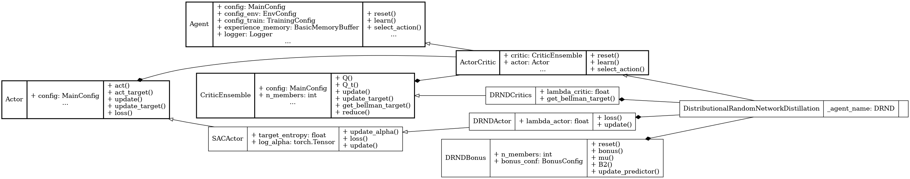

Distributional Random Network Distillation (DRND)
==================================================

.. raw:: html

   exploration
   distributional RL

**Paper**: `Exploration and Anti-Exploration with Distributional Random Network Distillation <https://raw.githubusercontent.com/mlresearch/v235/main/assets/yang24w/yang24w.pdf>`_

Pseudocode
----------

.. pdf-include:: ../../_static/pseudocodes/drnd.pdf
    :width: 100%

Configuration
----------------

.. literalinclude:: ../../../objectrl/config/model_configs/drnd.py
    :language: python
    :start-after: [start-config]
    :end-before: [end-config]
    :caption: Specific configuration for the DRND algorithm (in config/model_configs/).

UML Diagram
----------------

    UML diagram for the DRND algorithm.

.. raw:: html

   
We use the UML diagram to illustrate the relationships between the classes in our DRND implementation.

   
The diagram shows how the <code>DRNDActor</code> and <code>DRNDCritic</code> classes inherit from the base classes <code>Actor</code> and <code>CriticEnsemble</code>, respectively. <code>DistributionalRandomNetworkDistillation</code> class also inherits from <code>ActorCritic</code> class which inherits from <code>Agent</code>.

   
We illustrate each class's crucial attributes and methods for DRND. Specifically:

   
<code>get_bellman_target()</code> method in <code>DRNDCritic</code> class is implemented to compute the Bellman target with exploration bonuses derived from the DRND module.

   
<code>DRNDBonus</code> class is introduced to compute exploration signals by measuring the discrepancy between a fixed and a predictor network, similar to RND but using a distributional target.

   
The actor uses <code>DRNDActor</code> class to sample actions based on the regular policy and is trained using entropy-regularized policy gradients.

Classes
-------

.. autoclass:: objectrl.models.drnd.DRNDBonus
    :undoc-members:
    :show-inheritance:
    :private-members:
    :members:
    :exclude-members: _abc_impl

.. autoclass:: objectrl.models.drnd.DRNDActor
    :undoc-members:
    :show-inheritance:
    :private-members:
    :members:
    :exclude-members: _abc_impl

.. autoclass:: objectrl.models.drnd.DRNDCritics
    :undoc-members:
    :show-inheritance:
    :private-members:
    :members:
    :exclude-members: _abc_impl

.. autoclass:: objectrl.models.drnd.DRND
    :undoc-members:
    :show-inheritance:
    :private-members:
    :members:
    :exclude-members: _abc_impl
   