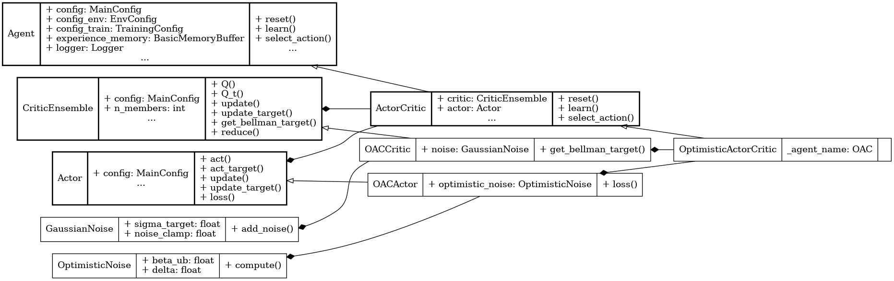

Optimistic Actor-Critic (OAC)
=============================

.. raw:: html

   optimistic
   exploration

**Paper**: `Better Exploration with Optimistic Actor-Critic <https://proceedings.neurips.cc/paper_files/paper/2019/file/a34bacf839b923770b2c360eefa26748-Paper.pdf>`_

Pseudocode
----------

.. pdf-include:: ../../_static/pseudocodes/oac.pdf
    :width: 100%

Configuration
----------------

.. literalinclude:: ../../../objectrl/config/model_configs/oac.py
    :language: python
    :start-after: [start-config]
    :end-before: [end-config]
    :caption: Specific configuration for the OAC algorithm (in config/model_configs/).

UML Diagram
----------------

    UML diagram for the OAC algorithm.

.. raw:: html

   
We use the UML diagram to illustrate the relationships between the classes in our OAC implementation.

   
The diagram shows how the <code>OACActor</code> and <code>OACCritic</code> classes inherit from the base classes <code>Actor</code> and <code>CriticEnsemble</code>, respectively. <code>OptimisticActorCritic</code> class also inherits from <code>ActorCritic</code> class which inherits from <code>Agent</code>.

   
We illustrate each class's crucial attributes and methods for OAC. Specifically:

   
<code>get_bellman_target()</code> method in <code>OACCritic</code> class is implemented to compute the Bellman target using actions perturbed by Gaussian noise, following the TD3-style target smoothing.

   
<code>OptimisticNoise</code> class is introduced to compute exploration noise by adjusting the mean of the actor's action distribution in the direction of the Q-value upper confidence bound.

   
<code>select_action()</code> method in <code>OptimisticActorCritic</code> class is modified to optionally use the optimistic mean for exploration, enabling uncertainty-aware policy execution.

Classes
-------

.. autoclass:: objectrl.models.oac.OptimisticNoise
    :undoc-members:
    :show-inheritance:
    :private-members:
    :members:
    :exclude-members: _abc_impl

.. autoclass:: objectrl.models.oac.GaussianNoise
    :undoc-members:
    :show-inheritance:
    :private-members:
    :members:
    :exclude-members: _abc_impl

.. autoclass:: objectrl.models.oac.OACActor
    :undoc-members:
    :show-inheritance:
    :private-members:
    :members:
    :exclude-members: _abc_impl

.. autoclass:: objectrl.models.oac.OACCritic
    :undoc-members:
    :show-inheritance:
    :private-members:
    :members:
    :exclude-members: _abc_impl

.. autoclass:: objectrl.models.oac.OptimisticActorCritic
    :undoc-members:
    :show-inheritance:
    :private-members:
    :members:
    :exclude-members: _abc_impl
   