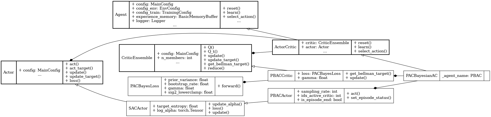

Deep Exploration with PAC-Bayes (PBAC)
======================================

.. raw:: html

   PAC-Bayes
   exploration
   uncertainty estimation

**Paper**: `Deep Exploration with PAC-Bayes <https://arxiv.org/pdf/2402.03055>`_

Pseudocode
----------

.. pdf-include:: ../../_static/pseudocodes/pbac.pdf
    :width: 100%

Configuration
----------------

.. literalinclude:: ../../../objectrl/config/model_configs/pbac.py
    :language: python
    :start-after: [start-config]
    :end-before: [end-config]
    :caption: Specific configuration for the PBAC algorithm (in config/model_configs/).

UML Diagram
----------------

    UML diagram for the PBAC algorithm.

.. raw:: html

   
We use the UML diagram to illustrate the relationships between the classes in our PBAC implementation.

   
The diagram shows how the <code>PBACActor</code> and <code>PBACCritic</code> classes inherit from the base classes <code>SACActor</code> and <code>CriticEnsemble</code>, respectively. <code>PACBayesianAC</code> class also inherits from <code>ActorCritic</code> class which inherits from <code>Agent</code>.

   
We illustrate each class's crucial attributes and methods for PBAC. Specifically:

   
<code>PACBayesLoss</code> class implements a custom critic loss that incorporates a PAC-Bayesian generalization bound with a bootstrap-based variance estimate to account for uncertainty.

   
<code>get_bellman_target()</code> method in <code>PBACCritic</code> class is implemented to compute entropy-regularized targets using the actor’s log probability.

   
<code>PBACActor</code> class overrides the <code>act()</code> method to support posterior sampling by randomly selecting a head from the ensemble at training time or averaging actions at evaluation time.

Classes
-------

.. autoclass:: objectrl.models.pbac.PACBayesLoss
    :undoc-members:
    :show-inheritance:
    :private-members:
    :members:
    :exclude-members: _abc_impl

.. autoclass:: objectrl.models.pbac.PBACActor
    :undoc-members:
    :show-inheritance:
    :private-members:
    :members:
    :exclude-members: _abc_impl

.. autoclass:: objectrl.models.pbac.PBACCritic
    :undoc-members:
    :show-inheritance:
    :private-members:
    :members:
    :exclude-members: _abc_impl

.. autoclass:: objectrl.models.pbac.PACBayesianAC
    :undoc-members:
    :show-inheritance:
    :private-members:
    :members:
    :exclude-members: _abc_impl
   