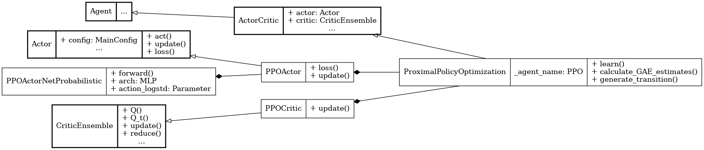

Proximal Policy Optimization (PPO)
==================================

.. raw:: html

   on-policy
   policy optimization
    clipping

**Paper**: `Proximal Policy Optimization Algorithms <https://arxiv.org/abs/1707.06347>`_

Pseudocode
----------

.. pdf-include:: ../../_static/pseudocodes/ppo.pdf
    :width: 100%

Configuration
----------------

.. literalinclude:: ../../../objectrl/config/model_configs/ppo.py
    :language: python
    :start-after: [start-config]
    :end-before: [end-config]
    :caption: Specific configuration for the PPO algorithm (in config/model_configs/).

UML Diagram
----------------

    UML diagram for the PPO algorithm.

.. raw:: html

   
We use the UML diagram to illustrate the relationships between the classes in our PPO implementation.

   
The diagram shows how the <code>PPOActor</code> and <code>PPOCritic</code> classes inherit from the base classes <code>Actor</code> and <code>CriticEnsemble</code>, respectively. <code>ProximalPolicyOptimization</code> class also inherits from <code>ActorCritic</code> class which inherits from <code>Agent</code>.

   
We illustrate each class's crucial attributes and methods for PPO. Specifically:

   
<code>PPOActorNetProbabilistic</code> class implements a probabilistic actor network with Gaussian policies for continuous actions.

   
<code>loss()</code> and <code>update()</code> methods in <code>PPOActor</code> class implement the PPO clipped surrogate objective and actor updates.

   
<code>update()</code> method in <code>PPOCritic</code> class updates the critic using Bellman targets computed externally.

   
<code>ProximalPolicyOptimization</code> class handles the overall training loop including generalized advantage estimation (GAE) and batched updates.

Classes
-------

.. autoclass:: objectrl.models.ppo.PPOActorNetProbabilistic
    :undoc-members:
    :show-inheritance:
    :private-members:
    :members:
    :exclude-members: _abc_impl

.. autoclass:: objectrl.models.ppo.PPOActor
    :undoc-members:
    :show-inheritance:
    :private-members:
    :members:
    :exclude-members: _abc_impl

.. autoclass:: objectrl.models.ppo.PPOCritic
    :undoc-members:
    :show-inheritance:
    :private-members:
    :members:
    :exclude-members: _abc_impl

.. autoclass:: objectrl.models.ppo.ProximalPolicyOptimization
    :undoc-members:
    :show-inheritance:
    :private-members:
    :members:
    :exclude-members: _abc_impl