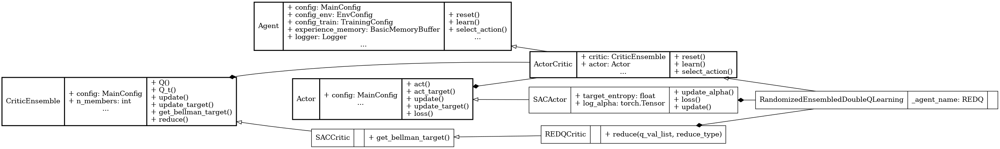

Randomized Ensembled Double Q-Learning (REDQ)
==============================================

.. raw:: html

   off-policy
   critic-ensemble

**Paper**: `Randomized Ensembled Double Q-Learning: Learning Fast Without a Model <https://openreview.net/pdf?id=AY8zfZm0tDd>`_

Pseudocode
----------

.. pdf-include:: ../../_static/pseudocodes/redq.pdf
    :width: 100%

Configuration
----------------

.. literalinclude:: ../../../objectrl/config/model_configs/redq.py
    :language: python
    :start-after: [start-config]
    :end-before: [end-config]
    :caption: Specific configuration for the REDQ algorithm (in config/model_configs/).

UML Diagram
----------------

    UML diagram for the REDQ algorithm.

.. raw:: html

   
We use the UML diagram to illustrate the relationships between the classes in our REDQ implementation.

   
The diagram shows how we use <code>SACActor</code> as the actor of REDQ and <code>REDQCritic</code> class inherit from the <code>SACCritic</code>. <code>RandomizedEnsembledDoubleQLearning</code> class also inherits from <code>ActorCritic</code> class which inherits from <code>Agent</code>.

   
We illustrate each class's crucial attributes and methods for REDQ. Specifically: 

   
<code>reduce()</code> method in <code>REDQCritic</code> class is implemented to sample a distinct subset of critics and calculate the critic target by reduction.

Classes
-------

.. autoclass:: objectrl.models.redq.REDQCritic
    :undoc-members:
    :show-inheritance:
    :private-members:
    :members:
    :exclude-members: _abc_impl

.. autoclass:: objectrl.models.redq.RandomizedEnsembledDoubleQLearning
    :undoc-members:
    :show-inheritance:
    :private-members:
    :members:
    :exclude-members: _abc_impl
