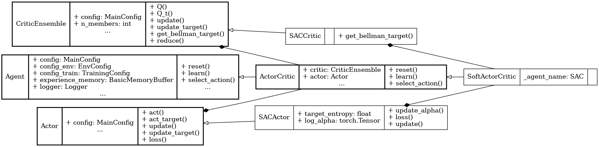

Soft Actor Critic (SAC)
=======================

.. raw:: html

   off-policy
   stochastic

**Paper**: `Soft Actor-Critic: Off-Policy Maximum Entropy Deep Reinforcement Learning with a Stochastic Actor <https://arxiv.org/abs/1801.01290>`_

Pseudocode
----------

.. pdf-include:: ../../_static/pseudocodes/sac.pdf
    :width: 100%

Configuration
----------------

.. literalinclude:: ../../../objectrl/config/model_configs/sac.py
    :language: python
    :start-after: [start-config]
    :end-before: [end-config]
    :caption: Specific configuration for the SAC algorithm (in config/model_configs/).

UML Diagram
----------------

    UML diagram for the SAC algorithm.

.. raw:: html

   
We use the UML diagram to illustrate the relationships between the classes in our SAC implementation.

   
The diagram shows how the <code>SACActor</code> and <code>SACCritic</code> classes inherit from the base classes <code>Actor</code> and <code>CriticEnsemble</code>, respectively. <code>SoftActorCritic</code> class also inherits from <code>ActorCritic</code> class which inherits from <code>Agent</code>.

   
We illustrate each class's crucial attributes and methods for SAC. Specifically: 

   
<code>get_bellman_target()</code> method in <code>SACCritic</code> class is implemented to compute the Bellman target for the critic in SAC style.

   
 <code>update_alpha()</code>, <code>loss()</code>, and <code>update()</code> methods in <code>SACActor</code> class are implemented to update the actor's policy and temperature parameter in SAC style.

Classes
-------

.. autoclass:: objectrl.models.sac.SACActor
    :undoc-members:
    :show-inheritance:
    :private-members:
    :members:
    :exclude-members: _abc_impl

.. autoclass:: objectrl.models.sac.SACCritic
    :undoc-members:
    :show-inheritance:
    :private-members:
    :members:
    :exclude-members: _abc_impl

.. autoclass:: objectrl.models.sac.SoftActorCritic
    :undoc-members:
    :show-inheritance:
    :private-members:
    :members:
    :exclude-members: _abc_impl