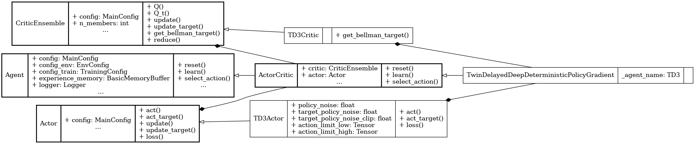

Twin Delayed DDPG (TD3)
=======================

.. raw:: html
    
   off-policy
   deterministic
   twin-critics
   delayed-update

**Paper**: `Addressing Function Approximation Error in Actor-Critic Methods <https://proceedings.mlr.press/v80/fujimoto18a/fujimoto18a.pdf>`_

Pseudocode
----------

.. pdf-include:: ../../_static/pseudocodes/td3.pdf
    :width: 100%

Configuration
----------------

.. literalinclude:: ../../../objectrl/config/model_configs/td3.py
    :language: python
    :start-after: [start-config]
    :end-before: [end-config]
    :caption: Specific configuration for the TD3 algorithm (in config/model_configs/).

UML Diagram
----------------

    UML diagram for the TD3 algorithm.

.. raw:: html

   
We use the UML diagram to illustrate the relationships between the classes in our TD3 implementation.

   
The diagram shows how the <code>TD3Actor</code> and <code>TD3Critic</code> classes inherit from the base classes <code>Actor</code> and <code>CriticEnsemble</code>, respectively. <code>TwinDelayedDeepDeterministicPolicyGradient</code> class also inherits from <code>ActorCritic</code> class which inherits from <code>Agent</code>.

   
We illustrate each class's crucial attributes and methods for TD3. Specifically: 

   
<code>get_bellman_target()</code> method in <code>TD3Critic</code> class is implemented to compute the Bellman target for the critic in TD3 style.

   
 <code>act()</code>, <code>act_target()</code>, and <code>loss()</code> methods in <code>TD3Actor</code> class are implemented to act in TD3 style and update the actor's policy.

Classes
-------

.. autoclass:: objectrl.models.td3.TD3Actor
    :undoc-members:
    :show-inheritance:
    :private-members:
    :members:
    :exclude-members: _abc_impl

.. autoclass:: objectrl.models.td3.TD3Critic
    :undoc-members:
    :show-inheritance:
    :private-members:
    :members:
    :exclude-members: _abc_impl

.. autoclass:: objectrl.models.td3.TwinDelayedDeepDeterministicPolicyGradient
    :undoc-members:
    :show-inheritance:
    :private-members:
    :members:
    :exclude-members: _abc_impl