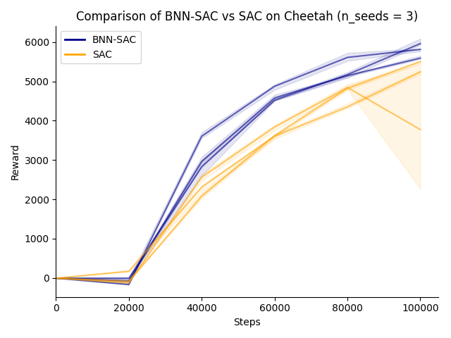

Example 3: Uncertainty-Aware SAC with Bayesian Neural Networks
===============================================================

This example demonstrates how an Agent can be quickly adapted to use Bayesian Neural Networks (BNNs).
We'll use Soft Actor-Critic (SAC) as our example and replace its critics with BNNs to quantify epistemic uncertainty in value function estimation.

Bayesian Neural Networks in ObjectRL
~~~~~~~~~~~~~~~~~~~~~~~~~~~~~~~~~~~~

ObjectRL contains implementations for a wide range of Bayesian layers, all assuming mean-field variational inference.

The implemented methods are:

1. **Bayes by Backprop**: Samples weights during every forward pass [#bbb]_

2. **Local Reparameterization**: Reduces gradient variance by sampling activations [#lr]_

3. **Central Limit Theorem Approximation**: Computes an analytical approximation of the post-activation output for piecewise linear activation functions and propagates their mean and variance [#clt_wu]_ [#clt_haussmann]_

All methods are implemented in ``bayesian_layers.py`` and can be used directly via the ``BayesianMLP`` class.

Implementation
~~~~~~~~~~~~~~

Implementing a BNN-SAC algorithm follows these four steps:

1. Implement the agent in ``models`` and add it to the ``get_model`` function
2. Implement the BNN critic network architecture
3. Create configuration classes for the new agent
4. Add the final config to ``config/model_configs``

1. The BNN-SAC Agent
^^^^^^^^^^^^^^^^^^^^

Since BNN-SAC is simply SAC with a different critic network architecture, ``BNNSoftActorCritic`` is a straightforward subclass of ``SoftActorCritic``:

.. code-block:: python

    from objectrl.models.sac import SACCritic, SACActor, SoftActorCritic

    class BNNSoftActorCritic(SoftActorCritic):
        """
        BNN-Soft Actor-Critic agent with BNN-Critic ensemble
        """

        _agent_name = "BNN-SAC"

        def __init__(
            self,
            config: "MainConfig",
            critic_type=SACCritic,
            actor_type=SACActor,
        ):
            """
            Initializes SAC agent.

            Args:
                config (MainConfig): Configuration dataclass instance.
                critic_type (type): Critic class type.
                actor_type (type): Actor class type.
            """
            super().__init__(config, critic_type, actor_type)

Adding it to the ``get_model`` function:

.. code-block:: python

    case "bnnsac":
        return BNNSoftActorCritic(config, critic.critic_type, actor.actor_type)

2. The BNN Critic Ensemble
^^^^^^^^^^^^^^^^^^^^^^^^^^

A BNN-based critic requires a new ``BNNCriticNet`` class with the following key changes from ``CriticNet``:

- Replace ``MLP`` with ``BayesianMLP`` using local reparameterization (``'lr'``) layers
- Add functionality to switch between maximum a posteriori (MAP) prediction and sampling (for completeness; we won't use it in this case study)
- Maintain single sample forward passes for computational efficiency

.. code-block:: python

    class BNNCriticNet(nn.Module):
        """
        A Bayesian Critic Network (Q-network).

        Args:
            dim_state (int): Observation space dimension.
            dim_act (int): Action space dimension.
            depth (int): Number of hidden layers.
            width (int): Width of each hidden layer.
            act (Literal["relu", "crelu"]): Activation function to use.
            has_norm (bool): Whether to include normalization layers.
        """

        def __init__(
            self,
            dim_state: int,
            dim_act: int,
            depth: int = 3,
            width: int = 256,
            act: Literal["relu", "crelu"] = "relu",
            has_norm: bool = False,
        ) -> None:
            super().__init__()

            # A BNN with local-reparameterization layers
            self.arch = BayesianMLP(
                dim_in=dim_state + dim_act,
                dim_out=1,
                depth=depth,
                width=width,
                act=act,
                has_norm=has_norm,
                layer_type="lr",
            )

            self._map = False

        def map(self, on: bool = True) -> None:
            "Switch maximum a-posteriori mode on/off"
            self._map = on
            for layer in self.arch:
                if hasattr(layer, "_map"):
                    layer.map(on)

        def forward(
            self, x: torch.Tensor
        ) -> torch.Tensor | tuple[torch.Tensor, torch.Tensor | None]:
            "Forward pass of the BNNCriticNet"

            return self.arch(x)

3. The configuration
^^^^^^^^^^^^^^^^^^^^

The configuration setup requires three components:

- **Actor Config**: Reuse ``SACActorConfig`` since the actor remains unchanged
- **Critic Config**: New configuration pointing to our ``BNNCriticNet``
- **Main Config**: Inherits from ``SACConfig`` with updated components

.. code-block:: python

    from dataclasses import dataclass, field

    from objectrl.config.model_configs.sac import SACActorConfig, SACConfig
    from objectrl.models.sac import SACCritic
    from objectrl.nets.critic_nets import BNNCriticNet

    BNNSACActorConfig = SACActorConfig

    @dataclass
    class BNNSACCriticConfig:
        """
        Configuration for the BNN-SAC critic network ensemble.

        Attributes:
            arch (type): Neural network architecture class for the critic.
            critic_type (type): Critic class type.
        """

        arch: type = BNNCriticNet
        critic_type: type = SACCritic

    @dataclass
    class BNNSACConfig(SACConfig):
        """
        Main BNN-SAC algorithm configuration class.

        Attributes:
            name (str): Algorithm identifier.
            loss (str): Loss function used for critic training.
            policy_delay (int): Number of critic updates per actor update.
            tau (float): Polyak averaging coefficient for target network updates.
            target_entropy (float | None): Target entropy for automatic temperature tuning.
            alpha (float): Initial temperature parameter.
            actor (SACActorConfig): Actor configuration.
            critic (SACCriticConfig): Critic configuration.
        """

        name: str = "bnnsac"

        actor: BNNSACActorConfig = field(default_factory=BNNSACActorConfig)
        critic: BNNSACCriticConfig = field(default_factory=BNNSACCriticConfig)

Running Experiments
~~~~~~~~~~~~~~~~~~~

We'll compare SAC with BNN-SAC by training both algorithms for 100,000 steps on the HalfCheetah environment:

**Standard SAC:**

.. code-block:: bash

    python objectrl/main.py --model.name "sac" --env.name "cheetah" --training.max-steps 100000

**BNN-SAC:**

.. code-block:: bash

    python objectrl/main.py --model.name "bnnsac" --env.name "cheetah" --training.max-steps 100000

Results
~~~~~~~
Repeating this experiment over three seeds (`--system.seed {1..3}`) gives the following result.
Each run is evaluated for ten episodes every 20k steps. Plotted are the median over each of these
together with the upper and lower quartiles.
The simple switch from deterministic critics to BNN-based critics provides a clear improvement.

Future Extensions
~~~~~~~~~~~~~~~~~

Given the object oriented framework, this example can be extended in a straightforward manner
to explore, e.g.,

1. **Enhanced Posterior Sampling**
    Instead of single samples, leverage the full variational posterior distribution by:

    - Implementing ensemble-based critics that sample multiple times
    - Creating a new ``BNNSACCritic`` class that aggregates uncertainty estimates
    - Using Thompson sampling for exploration based on posterior uncertainty

2. **Bayesian Actor Networks**
    Extend uncertainty quantification to the policy:

    - Implement ``BNNSACActor`` with Bayesian policy networks
    - Enable uncertainty-aware action selection
    - Combine epistemic and aleatoric uncertainty for robust policies

3. **Advanced Uncertainty Integration**
    Sophisticated uncertainty utilization:

    - Information-theoretic exploration bonuses
    - Risk-sensitive policy optimization
    - Adaptive learning rates based on uncertainty estimates

.. rubric:: References

.. [#bbb] Blundell, C., et al. (2015), *Weight uncertainty in neural networks*
.. [#lr] Kingma, DP., et al., (2015), *Variational dropout and the local reparameterization trick*
.. [#clt_wu] Wu, A., et al., (2018), *Deterministic variational inference for robust bayesian neural networks*
.. [#clt_haussmann] Haussmann, M. (2021), *Bayesian Neural Networks for Probabilistic Machine Learning*